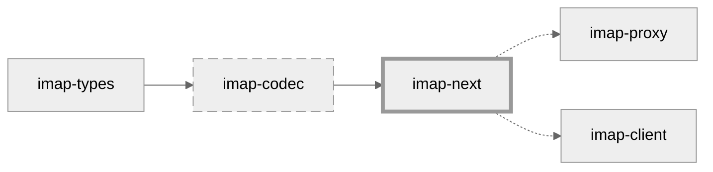

[](https://github.com/duesee/imap-next/actions/workflows/main.yml)
[](https://github.com/duesee/imap-next/actions/workflows/audit.yml)
[](https://coveralls.io/github/duesee/imap-next?branch=main)

# imap-next



`imap-next` is a thin sans I/O abstraction over IMAP's distinct protocol flows.
These are literal handling, AUTHENTICATE, and IDLE.

The way these protocol flows were defined in IMAP couples networking, parsing, and business logic.
`imap-next` untangles them, providing a minimal interface allowing sending and receiving coherent messages.
It's a thin layer paving the ground for higher-level client or server implementations.
And it's sans I/O enabling the integration in any existing I/O runtime.

## Lower-level Libraries

`imap-next` uses [`imap-codec`](https://github.com/duesee/imap-codec) internally for parsing and serialization, and
re-exposes [`imap-types`](https://github.com/duesee/imap-codec/tree/main/imap-types).

## Higher-level Libraries

* [`imap-proxy`](https://github.com/duesee/imap-proxy) is an IMAP proxy that gracefully forwards unsolicited responses,
  abstracts over literals, and `Debug`-prints messages.
* [`imap-client`](https://github.com/soywod/imap-client) is a methods-based client library with
  a `client.capability()`, `client.login()`, ... interface.

## Usage

```rust,no_run
use std::error::Error;
use imap_next::{
    client::{Client, Event, Options},
    imap_types::{
        command::{Command, CommandBody},
        core::Tag,
    },
    stream::Stream,
};
use tokio::net::TcpStream;

#[tokio::main]
async fn main() -> Result<(), Box<dyn Error>> {
    let mut stream = Stream::insecure(TcpStream::connect("127.0.0.1:1143").await?);
    let mut client = Client::new(Options::default());

    loop {
        match stream.next(&mut client).await? {
            event => {
                println!("{event:?}");

                if matches!(event, Event::GreetingReceived { .. }) {
                    break;
                }
            }
        }
    }

    let handle = client.enqueue_command(Command::new("A1", CommandBody::login("Al¹cE", "pa²²w0rd")?)?);

    loop {
        match stream.next(&mut client).await? {
            event => println!("{event:?}"),
        }
    }
}
```

# License

This crate is dual-licensed under Apache 2.0 and MIT terms.

# Thanks

Thanks to the [NLnet Foundation](https://nlnet.nl/) for supporting `imap-next` through
their [NGI Assure](https://nlnet.nl/assure/) program!

<div align="right">
    
    
    
</div>
