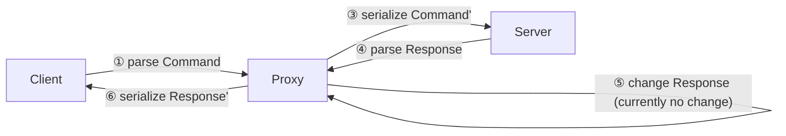

# IMAP Proxy

A proxy that receives, `Debug`-prints, and forwards IMAP messages.

It should™ forward all messages *without changing their semantics*. (See note below.)

Still, ...

> [!WARNING]
> **Don't use in production (yet)!**

## Features

Thanks to `imap-flow`, the proxy ...

* takes advantage of asynchronous I/O,
* abstracts away literal handling, and
* fully supports unsolicited responses,

... making it easy to modify.

## Overview



> [!NOTE]
> A few semantic changes are required to make the proxy more useful.
> These changes are communicated by the proxy, e.g., by emitting a warning or prefixing a `text` field.
>
> **Literal handling** IMAP allows sending commands "piece-by-piece" using literals.
> However, forwarding single pieces rules out modifications that change the size of a literal.
> Thus, the proxy collects all pieces first and presents single messages that can be easily replaced (if so desired).
>
> **Capability stripping** Capabilities can introduce fundamental protocol changes.
> Thus, forwarding unknown capabilities would mean we are willing to "lose track" of our session understanding.
> It also implies the proxy needs to forward unparsed messages and (somehow) "get on track" at some later point.
> Doing so requires an in-depth analysis of the problem and its implications.
> Thus, we prefer to strip unsupported capabilities and error out on parsing errors.

# Quickstart

Change into the `proxy` folder and run ...

```shell
cargo run -- --help
```

... for an overview of arguments.

**Important**: You must enable tracing (logging) to see a `Debug`-print of exchanged messages.

To do so, set the `RUST_LOG` environment variable.

Use ...

```sh
RUST_LOG=proxy=trace cargo run
```

... to start the proxy (using the default `config.toml`), enabling all log messages for the "proxy" module.

## Config

Have a look at the `config.toml` file for different scenarios.
The first scenario "Insecure to TLS" is useful for a (local) forwarding proxy and is already enabled.

Note that you can start multiple services using TOML's [array of tables](https://toml.io/en/v1.0.0#array-of-tables) syntax:

```toml
[[services]]
# ...

[[services]]
# ...
```

The `encryption` field configures transport encryption, i.e., `Insecure` or `Tls`.
`Insecure` disables TLS encryption and SHOULD NOT be used when proxying to a remote server.

# Creation of local TLS certificates

Please install (and use) [`mkcert`](https://github.com/FiloSottile/mkcert) to create a local certificate authority (CA).
The tool takes care to "register" the local CA with [typical trust stores](https://github.com/FiloSottile/mkcert#supported-root-stores) on your system.

We recommend creating a `private` folder in the `proxy` directory before creating certificates and keys.
The `private` folder is `.gitignore'd, so you can't accidentally push your keys.

```shell
mkdir private
cd private
```

With `mkcert`, you should now be able to create a certificate (+ key), e.g., ...

```shell
mkcert localhost
```

The command creates two files, `localhost.pem` (certificate) and `localhost-key.pem` (key). Now, edit your `config.toml` ...

```toml
[services.bind.identity]
type = "CertificateChainAndLeafKey"
certificate_chain_path = "private/localhost.pem"
leaf_key_path = "private/localhost-key.pem"
```

... accordingly, start the proxy, and test your connection with OpenSSL, e.g., ...

```shell
openssl s_client -verify_return_error -crlf -connect <host>:<port>
```

Note: `openssl s_client` should only really be used for testing.


# Current purpose

Proxies are a great way to challenge the usability of a network library such as `imap-flow`.
To implement a proxy, it's required to implement both the server- and client-side, and the tasks require designing the library in a way that allows even fine-grained forwarding.
Further, a usable proxy would significantly extend the exposure of `imap-codec` to real-world network traces.
It should be possible to permanently stick the proxy between real-world IMAP sessions, e.g., to track day-to-day email sessions (and ask other contributors to conduct the same test.)

# Future work

The proxy could enrich existing clients' functionality to improve compatibility, performance, and security.
This could be done by fleshing out the proxy into a configurable framework.

Examples:

* Support
  * `XOAUTH2` could transparently be added to non-supporting clients
* Security
    * Encryption could be transparently added such that emails are always appended in encrypted form and decrypted during fetching
* Support & Security
  * Vintage clients could use the proxy as a TLS/Compatibility gateway (See ["Using modern email on vintage clients"](https://julienblanchard.com/articles/modern-email-and-vintage-clients).)
* Performance
  * Support for "capabilities in greetings" or `LITERAL+` could be transparently added to improve performance
* Testing
  * Messages could be forwarded to other software for analysis
  * Protocol traces could be automatically analyzed for supported features
  * Proxy could inject non-semantic changes to expose interoperability issues (See issue #62.)
