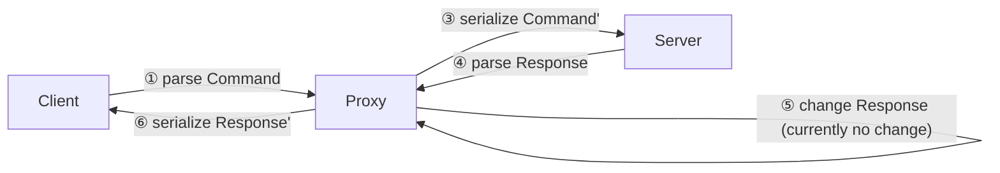

# IMAP Proxy

A proxy that receives, `Debug`-prints, and forwards IMAP messages.

It should™ forward all messages *without changing their semantics*. (See note below.)

Still, ...

> [!WARNING]
> **Don't use in production yet!**

## Overview



> [!NOTE]
> IMAP is a malleable protocol that allows sending commands "piece-by-piece" using "literals".
> We generally don't preserve semantically irrelevant information such as casing or optional braces.
> Further, we abstract literal handling to make the proxy more helpful.
> Essentially, the proxy presents messages "in one piece", meaning they can be easily exchanged (if so desired).
> Still, the literal abstraction introduces a (minor) semantic change.
> While this could be rectified in the future, it should be mostly irrelevant in practice.

# Quickstart

Change into the `proxy` folder and run ...

```shell
cargo run -- --help
```

... for an overview of arguments.

**Important**: You must enable tracing (logging) to see a `Debug`-print of exchanged messages.

To do so, set the `RUST_LOG` environment variable.

Use ...

```sh
RUST_LOG=proxy=trace cargo run
```

... to start the proxy (using the default `config.toml`), enabling all log messages for the "proxy" module.

## Config

Have a look at the `configs` folder for different scenarios.

You can start multiple services using TOML's [array of tables](https://toml.io/en/v1.0.0#array-of-tables) syntax:

```toml
[[services]]
# ...

[[services]]
# ...
```

The `encryption` field configures transport encryption, i.e., `Insecure` or `Tls`.
`Insecure` disables TLS encryption and SHOULD NOT be used when proxying to a remote server.

## Features

Thanks to `imap-flow`, the proxy ...

* takes advantage of asynchronous I/O,
* abstracts away literal handling, and
* fully supports unsolicited responses,

... making it easy to modify.

# Current purpose

Proxies are a great way to challenge the usability of a network library such as `imap-flow`.
To implement a proxy, it's required to implement both the server- and client-side, and the tasks require designing the library in a way that allows even fine-grained forwarding.
Further, a usable proxy would significantly extend the exposure of `imap-codec` to real-world network traces.
It should be possible to permanently stick the proxy between real-world IMAP sessions, e.g., to track day-to-day email sessions (and ask other contributors to conduct the same test.)

# Future work

The proxy could enrich existing clients' functionality to improve compatibility, performance, and security.
This could be done by fleshing out the proxy into a configurable framework.

Examples:

* `XOAUTH2` could transparently be added to non-supporting clients
* Support for "capabilities in greetings" or `LITERAL+` could be transparently added to improve performance
* Encryption could be transparently added such that emails are always appended in encrypted form and decrypted during fetching
* Vintage clients could use the proxy as a TLS gateway
* Messages could be forwarded to other software for analysis
* Protocol traces could be automatically analyzed for supported features
